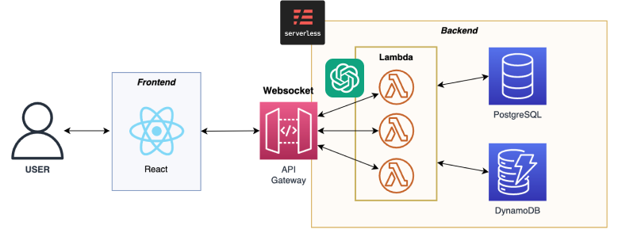
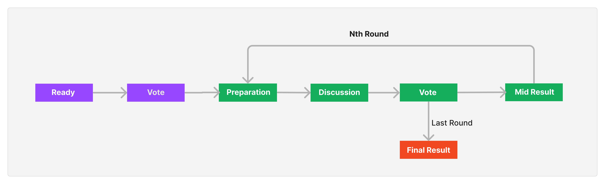
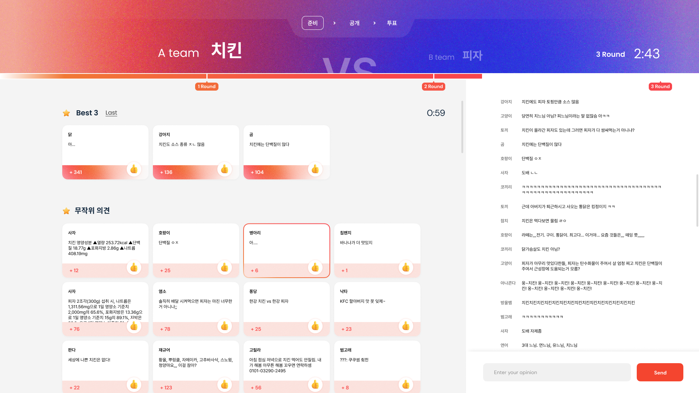

# Naruhodoo (나루호두)

> **Github Page Link:** https://kookmin-sw.github.io/capstone-2023-05

> **Code Repository Link:** https://github.com/kookmin-sw/capstone-2023-05

---

## 목차

- [Naruhodoo (나루호두)](#naruhodoo-나루호두)
  - [목차](#목차)
  - [1. 프로젝트 소개 :globe\_with\_meridians:](#1-프로젝트-소개-globe_with_meridians)
  - [2. 문제 인식 :pushpin:](#2-문제-인식-pushpin)
      - [주요 타겟 이용자](#주요-타겟-이용자)
  - [3. 문제 해결 :gem:](#3-문제-해결-gem)
      - [기대효과](#기대효과)
  - [4. 토론의 흐름 :arrows\_clockwise:](#4-토론의-흐름-arrows_clockwise)
  - [5. 핵심 기능 :star:](#5-핵심-기능-star)
  - [6. 용어 정리 :bookmark\_tabs:](#6-용어-정리-bookmark_tabs)
  - [7. 사용 기술 :computer:](#7-사용-기술-computer)
      - [Collaboration](#collaboration)
      - [Frontend](#frontend)
      - [Backend](#backend)
  - [8. 팀 소개 :boy:](#8-팀-소개-boy)

---

## 1. 프로젝트 소개 :globe_with_meridians:

라이브 방송에서 시청자들과 방송 진행자가 모두 함께 모여 토론을 할 수 있는 플랫폼입니다.

 
 

## 2. 문제 인식 :pushpin: 

Youtube, TwitchTV 등 라이브 스트리밍 서비스에서는 다양한 주제로 토론을 벌이곤 합니다. 이때, 시청자들은 자신의 의견을 채팅을 통해 표명할 수 있습니다. 그러나 시청자가 많은 경우, 빠르게 올라가는 채팅 목록으로 인해 시청자는 자신의 의견을 스트리밍 참가자들에게 전달하기 어렵고, 방송인은 대부분의 채팅을 놓치거나 일부 의견에 대해서만 언급할 수밖에 없습니다.
 

#### 주요 타겟 이용자  

-   시청자 수가 많아 채팅 창을 실시간 모니터링 하기 어려운, 토론/토크 컨텐츠 방송인
-   자신의 의견을 적극적으로 표출하고, 방송인과 상호작용 하며 재미를 얻기를 원하는 하는 시청자

  

## 3. 문제 해결 :gem: 

플랫폼을 이용하여 대립되는 주제에 대한 방을 만들고 유저들은 그 토론 방에 참여하여 팀을 가르고 의견을 냅니다. 의견을 내는 과정에서 플랫폼 프로세스에 의해 Best 의견을 선정하고 이러한 의견과 수치를 화면에 띄워서 방송진행자와 유저들에게 보여줍니다.

#### 기대효과

-   시청자가 보다 능동적으로 토론 컨텐츠에 참여할 수 있도록 만듭니다.
-   방송인은 시청자의 다양한 주류 의견을 시각적으로 확인하고, 수치를 기반으로 토론을 진행할 수 있습니다. (일방적 진행에 대한 논란 차단)

  

## 4. 토론의 흐름 :arrows_clockwise: 

> :warning: 해당 페이지는 아직 구현 중입니다.

https://www.naruhodoo.today

1.  Host는 양자택일로 대립되는 토론 주제에 대해 토론 방을 만들 수 있습니다.
    -   이 세상에 문과 바퀴 중 무엇이 더 많을까?
    -   유비와 조조 중 직장 상사로 누가 더 나을까?
    -   여름과 겨울 평생 한 계절로 살아야 한다면?
2.  시청자는 생성된 링크의 방에 참가합니다.
3.  시청자는 대립되는 의견에서 지지하는 팀을 선택합니다.
4.  토론 준비 단계에서는 각 팀에 속한 시청자가 자신 의견을 올릴 수 있고 더불어 지지하는 의견에 좋아요를 누를 수 있습니다.
5.  토론 준비 시간이 종료되면 가장 많은 Like를 받은 의견 Top 3을 모두에게 공개하고, 호스트(방송인)이 공개된 의견을 바탕으로 방송을 진행합니다.
6.  위의 3~4 과정을 반복하여 토론을 계속 진행합니다.
7.  토론 결과를 수치로 보여줍니다.

 
 

## 5. 핵심 기능 :star:

-   #### :key: 의견 선출 프로세스

    1. Refresh Rate(갱신 간격)마다 Likes 수가 높은 상위 N개의 의견이 살아남고 나머지 의견은 Ads에서 사라집니다.
    2. Refresh 단위 시간 당 Likes 수가 높은 상위 N개가 살아남고 나머지 의견은 사라집니다.
    3. 살아남은 의견은 다시 Like를 받을 수 있습니다.
    4. User는 살아남은 의견에 Like를 다시 누를 수 있습니다. 
    5. 유저에게 보이는 UI상의 모든 의견은 Like 수를 숨겨서 편향을 억제합니다.
    6. BEST 의견은 단위 시간당 좋아요 수가 가장 높은 Top 3입니다.
    7. 단위 시간당 가장 많은 좋아요를 받은 의견이 가장 자극적이고 재미있는 것으로 판단합니다. 예시로 1 refresh cycle동안 100표를 받고 내려간 의견이 3 refresh cycle동안 50/50/50 likes를 받고 내려간 의견을 이기고 Best로 선정됩니다.
    8. 한 사람이 1 refresh cycle동안 Like를 누를 수 있는 횟수를 M회로 제한합니다.

-   #### :heart: 좋아요 기능

    유저들은 의견을 클릭해서 자신이 공감하는 의견에 공감을 표할 수 있습니다.

-   #### :speech_balloon: 팀 선택 기능
    토론이 진행됨에 따라 유저의 팀 선택이 달라지고 이를 수치화하여 시청자들이 어떠한 입장의 팀을 더 많이 지지하는지 시각적으로 볼 수 있습니다.

  

## 6. 용어 정리 :bookmark_tabs: 

* ### 토론의 단계 관련 용어 :speech_balloon:

>    -   **Ready (토론 대기 상태)**: 게임 시작 전 유저를 모으는 단계
>    -   **Vote (팀 선택 단계)**: 유저들이 원하는 팀을 선택하는 단계
>    -   **Preparation (토론 준비 단계)**: 토론 의견들을 준비하는 상태
>    -   **Discussion (토론 단계)**:   양 팀의 의견을 공개해서 방장이 토론을 진행하는 단계
>    -   **Mid Result (중간 결과 단계)**:   라운드가 끝날 때마다 투표 결과를 알려주는 단계
>    -   **Final Result (최종 결과 단계)**:   최종 라운드에서 보여주는 결과 단계

* ### 의견 표출 및 선정 관련 용어 :key:
> -   **Best (베스트)**: 프로세스에 의해 선정된 대표 의견들을 보여주는 UI
> -   **Ads (광고판)**: 채팅으로부터 랜덤으로 추출되어 유저가 투표할 수 있는 상태의 의견들
> -   **Chat (채팅)**: 유저가 낸 모든 의견들
> -   **Opinion (의견)**: 유저가 내는 의견
> -   **Refresh Rate (갱신 간격)**: 갱신되는 간격
> -   **Refresh (갱신)**: Chat으로부터 새로운 의견을 랜덤 샘플링하여 Ads에 게시하고, Likes를 기반으로 Ads와 Best를 업데이트

* ### 그 외 일반 용어 :bulb:
>-   **Host (방장)**: 토론을 주최한 사람
>-   **User (사용자)**: 토론에 참여한 사람
>-   **Round (라운드)**: Preparation -> Disucussion -> Vote -> Mid-Result 네 단계를 묶어서 하나의 사이클로 지칭하는 단위
>-   **Like (좋아요)**: 유저가 공감하는 의견에 표시하는 것

  

## 7. 사용 기술 :computer: 

#### Collaboration

* 

  
   

#### Frontend

* 

  
   
  
  
  

#### Backend

* 

  
   
  

 
 

## 8. 팀 소개 :boy: 

| 이름   | 학과           | 학번     | 이메일                    | Github Link                       | 역할     |
| ------ | -------------- | -------- | ------------------------- | --------------------------------- | -------- |
| 성창훈 | 소프트웨어학과 | 20181628 | whtiesilver@kookmin.ac.kr | https://github.com/ChangHoon-Sung | Backend  |
| 이승호 | 소프트웨어학과 | 20181663 | poream3387@kookmin.ac.kr  | https://github.com/PricelessCode  | Backend  |
| 이영균 | 소프트웨어학과 | 20181666 | yglee981130@kookmin.ac.kr |         https://github.com/0gyun                     | Frontend |
| 이용준 | 소프트웨어학과 | 20181669 | joon0351@kookmin.ac.kr    | https://github.com/Binsk-dev      | Backend  |
| 이재욱 | 소프트웨어학과 | 20181670 | swljw@kookmin.ac.kr       | https://github.com/Jaewook-Lee    | Backend  |
